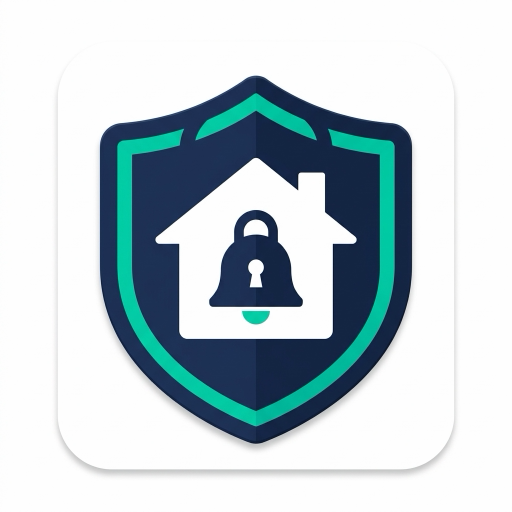
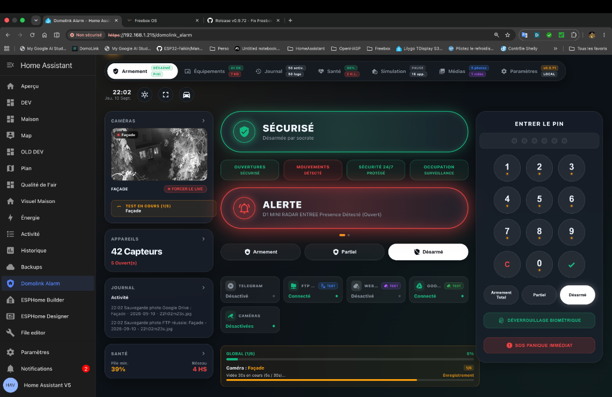
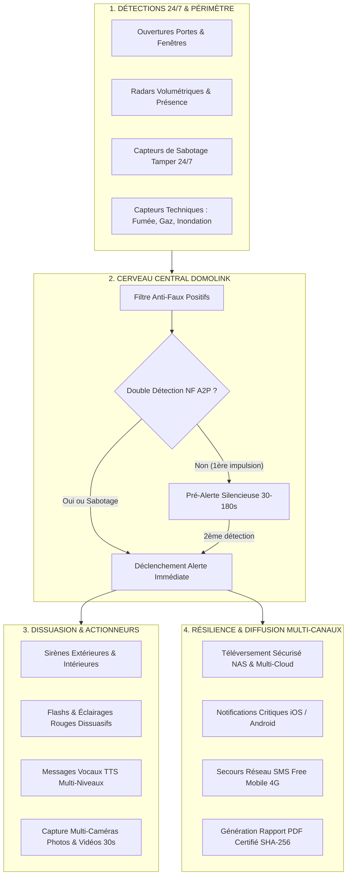

# <p align="center"><br>🚨 Domolink Alarm</p>

<p align="center">
  <strong>La centrale d'alarme intelligente la plus puissante, complète et modulaire jamais conçue pour Home Assistant.</strong><br>
  <em>Sécurité certifiable NF A2P • Multi-Cloud & NAS • Apple CarPlay & Android Auto • Rapports PDF SHA-256 • Mise à Jour 1-Clic</em>
</p>

<p align="center">
  <a href="https://github.com/SocrateMobile/Domolink-Alarm/releases"></a>
  <a href="https://github.com/SocrateMobile/Domolink-Alarm/actions"></a>
  <a href="https://hacs.xyz"></a>
  <a href="https://www.home-assistant.io"></a>
  <a href="LICENSE"></a>
</p>

---

<p align="center">
  
</p>

---

## 💎 Pourquoi Domolink Alarm surpasse les solutions existantes ?

La plupart des alarmes domotiques se limitent à déclencher une sirène sur un simple changement d'état. **Domolink Alarm réinvente la sécurité résidentielle** en intégrant les fonctionnalités réservées jusqu'alors aux centrales professionnelles haut de gamme (**Ajax, Daitem, Somfy Pro**) tout en restant **100% locale, souveraine et personnalisable**.

```
  ┌─────────────────────────────────────────────────────────────────────────────┐
  │                               DOMOLINK ALARM                                │
  │    La convergence entre sécurité certifiée et domotique ultra-connectée    │
  └───────┬───────────────────────────────┬─────────────────────────────┬───────┘
          ▼                               ▼                             ▼
   🛡️ FIABILITÉ PRO               ☁️ SOUVERAINETÉ MULTI-CLOUD    🚗 MOBILITÉ TOTALE
   Norme NF A2P anti-faux          FTP (512 Ko/bloc), FTPS,       Apple CarPlay, Android Auto,
   positifs, codes invités &       SFTP, SAMBA, WebDAV Nextcloud  Apple Watch, Wear OS, Kiosque
   rapport PDF officiel SHA-256    et Google Drive automatique    Mural OLED & Tablettes de bord
```

---

## ⚔️ Tableau Comparatif : Domolink Alarm vs Alarmes Standards

| Fonctionnalité | Domolink Alarm | Alarmes Standards (Alarmo, etc.) | Centrales Propriétaires (Ajax / Daitem) |
| :--- | :---: | :---: | :---: |
| **Interface de Gestion Dédiée (Sidebar Panel)** | **✅ Oui (Panneau complet Glassmorphism)** | ⚠️ Panneau basique | ❌ Application fermée |
| **Double Détection / Confirmation NF A2P** | **✅ Oui (Fenêtre 30s-180s configurable)** | ❌ Non | ✅ Oui (sur modèles haut de gamme) |
| **Mise à Jour Automatique 1-Clic avec Badge** | **✅ Oui (Directement dans la barre latérale)** | ❌ Manuel | ⚠️ Partiel (Cloud captif) |
| **Rapport d'Incident Certifié PDF (Assurance & Police)** | **✅ Oui (A4 officiel + signature SHA-256)** | ❌ Non | ❌ Non |
| **Sauvegarde Multi-Cloud Externe Instantanée** | **✅ FTP (512K), FTPS, SFTP, SMB, WebDAV, G-Drive**| ❌ Local uniquement | ⚠️ Cloud propriétaire payant |
| **Profils Invités, Nounou, Ménage & Usage Unique** | **✅ Oui (Avec créneaux et validité calendaire)**| ⚠️ Codes basiques sans plages | ⚠️ Limité |
| **Mode Voiture Dédié (Apple CarPlay & Android Auto)** | **✅ Oui (Boutons tactiles XXL 80px & contrastés)**| ❌ Non | ❌ Non |
| **Mode Kiosque Mural & Écran Tactile OLED** | **✅ Oui (Plein écran, économiseur noir & réveil tap)**| ❌ Non | ❌ Non |
| **Support Montres Connectées (Apple Watch & Wear OS)** | **✅ Oui (Capteur compact & Complications dédiées)**| ⚠️ Partiel | ⚠️ Application mobile |
| **Simulation de Présence par Réapprentissage J-7** | **✅ Oui (Rejoue l'historique réel de la maison)**| ⚠️ Simple aléatoire | ❌ Non |
| **Secours Réseau / 4G (Failover Alerting & Free SMS)**| **✅ Oui (Bascule automatique SMS / Sirène locale)**| ❌ Non | ⚠️ Nécessite carte SIM payante |
| **Levée de Doute Photo & Vidéo Multi-Caméras (30s)** | **✅ Oui (Toutes caméras simultanées + Arlo)** | ⚠️ 1 seule photo | ⚠️ Option payante |

---

## 🏛️ Architecture & Flux de Sécurité



---

## 🌟 Les 8 Piliers d'Excellence de Domolink Alarm

### 🛡️ 1. Double Détection & Confirmation d'Intrusion (Norme NF A2P)
* **Zéro Faux Positifs** : L'alarme ne s'emballe jamais pour une simple mouche ou un voilage qui bouge. L'alarme générale exige **soit 2 capteurs distincts**, soit **deux sollicitations du même capteur** dans un intervalle réglable (30s à 180s).
* **Pré-Alerte Visuelle & Décompte** : En cas de première impulsion suspecte, un bandeau de pré-alerte s'affiche en direct avec décompte des secondes et carillon préventif avant la mise en route des sirènes hurlantes.

---

### 👥 2. Profils Personnalisés, Invités & Codes à Usage Unique
* **Rôles Dédiés** : Créez des profils nominatifs adaptés à votre quotidien (*Famille, Invité, Aide ménagère, Nounou, Artisan, Voisin*).
* **Usage Unique Instantané** : Le code PIN est automatiquement détruit dès le premier désarmement réussi (parfait pour les livraisons ou dépannages en votre absence).
* **Plages Horaires & Calendrier** : Autorisez l'accès uniquement le lundi et jeudi de 08:00 à 12:00, ou définissez une date limite de validité.
* **Traçabilité Totale** : Chaque action est consignée dans le journal avec le nom de l'utilisateur (*« Désarmé par Nounou (Code temporaire) »*).

---

### 📑 3. Rapport d'Incident Certifié PDF (Export Assurances & Police)
* **Attestation Officielle A4** : En cas de tentative d'effraction ou d'intrusion confirmée, Domolink génère instantanément un rapport officiel imprimable en 1 clic au format A4 (`@media print`).
* **Empreinte Cryptographique SHA-256** : Chaque rapport calcule une clé de hachage infalsifiable garantissant l'intégrité des preuves (horodatage à la seconde, liste exhaustive des capteurs sollicités, réactions des sirènes et notifications).
* **Conformité Judiciaire** : Conçu spécifiquement pour accélérer vos déclarations auprès des compagnies d'assurance et des dépôts de plainte.

---

### ☁️ 4. Sauvegardes Multi-Cloud & NAS Haute Performance
* **Transfert FTP Accéléré (Blocksize 512 Ko)** : Téléversement jusqu'à **10x plus rapide** des clips vidéo lourds (10 à 50 Mo) sans bloquer le réseau local.
* **Sélecteur Multi-Protocoles** :
  - **FTP standard** (port 21)
  - **FTPS explicite chiffré SSL/TLS** avec protection du canal de données (`prot_p`)
  - **SFTP** sécurisé via SSH (port 22)
  - **Partage Réseau SAMBA / SMB** (port 445) avec lien direct `smb://` pour macOS et Windows
  - **WebDAV / Nextcloud** (port 5006 HTTPS)
  - **Google Drive Cloud** (Webhook Google Apps Script déployable en 1 minute sans abonnement)
* **Rétention & Rotation FIFO** : Définissez une limite de stockage (ex: 5 Go) et une durée de conservation (ex: 30 jours) : les enregistrements les plus anciens sont automatiquement purgés.

---

### 🔄 5. Mise à Jour Automatique 1-Clic & Pastille Barre Latérale
* **Détection Proactive en Arrière-Plan** : Interroge régulièrement l'API GitHub sans ralentissement et sans aucune dépendance.
* **Pastille dans la Barre Latérale Home Assistant** :
  - L'icône du menu de gauche s'illumine : `Domolink Alarm 🔴` avec bouclier d'alerte `mdi:shield-alert`.
  - Un badge visuel contrasté `MAJ` est affiché directement sur l'élément de menu.
* **Entité Native `update.domolink_alarm`** : Intégrée au système officiel de mises à jour de Home Assistant (*Paramètres > Système > Mises à jour*).
* **Bouton 1-Clic dans le Panneau** : Cliquez sur `[🚀 Mise à jour auto]`, découvrez le changelog officiel, confirmez et admirez : téléchargement du ZIP, sauvegarde préalable de sécurité, remplacement des fichiers et redémarrage propre de Home Assistant avec reconnexion automatique !

---

### 🚗 6. Mobilité & Véhicules (Apple CarPlay, Android Auto & Smartwatches)
* **Mode Voiture Haute Visibilité** : Conçu pour les systèmes embarqués (Apple CarPlay, Android Auto, Tesla, tablettes de bord).
  - Boutons d'armement tactiles géants de **80px** de haut, prévenant toute fausse manipulation en conduisant.
  - Pavé numérique grand format avec touches C (Effacer) et ✓ (Valider).
  - Accès direct via URL `?mode=car` ou bouton dédié dans le bandeau.
* **Apple Watch & Wear OS** : Entité compacte dédiée `sensor.domolink_watch_status` spécialement optimisée pour les complications de cadrans au poignet.
* **Geofencing Intelligent & Rappels Prédictifs** : Rappel d'oubli d'armement à 500 m du domicile avec bouton d'action rapide et rappel temporaire (*Snooze 15 min*).

---

### 📺 7. Mode Kiosque Mural & Expérience Écran Tactile
* **Affichage Plein Écran Kiosque** : Masque les barres de navigation superflues d'un seul tap pour transformer n'importe quelle tablette murale (iPad, Galaxy Tab, Fire HD) en véritable centrale d'alarme de luxe.
* **Économiseur d'Écran OLED Noir Profond** : Protection anti-marquage d'écran (burn-in) avec horloge discrète en mouvement lent et réveil instantané au simple effleurement de la dalle.

---

### 💡 8. Simulation de Présence Intelligente & Dissuasion Réflexe
* **Rejeu d'Historique Réel à J-7** : Dès que l'alarme est armée en mode Absent, le système rejoue à la seconde près les allumages de lumières et prises enregistrés une semaine plus tôt dans la base de données Home Assistant. Les cambrioleurs ont l'illusion parfaite d'une maison occupée.
* **Mode Carillon Vocal (Chime)** : Annonce vocale douce sur vos enceintes lors de l'ouverture d'une porte lorsque l'alarme est désarmée (*« Porte d'entrée ouverte »*).
* **Lumières de Panique** : Flash stroboscopique dissuasif de vos ampoules connectées dès le début du délai d'entrée pour faire fuir l'intrus avant même que la sirène ne retentisse.

---

## 📲 Installation Express (HACS)

1. Ouvrez **HACS** dans votre Home Assistant.
2. Cliquez sur les 3 points en haut à droite ➔ **Dépôts personnalisés**.
3. Ajoutez l'URL suivante :
   ```text
   https://github.com/SocrateMobile/Domolink-Alarm
   ```
   *Catégorie : Intégration*
4. Cliquez sur **Télécharger**, puis redémarrez Home Assistant.
5. Rendez-vous dans **Paramètres > Appareils et services > Ajouter une intégration** et sélectionnez **Domolink Alarm**.
6. Laissez-vous guider par l'assistant de configuration UI !

---

## 🎛️ Intégration Dashboard Lovelace (Optionnel)

En plus de son panneau dédié dans la barre latérale, Domolink Alarm peut s'intégrer directement au cœur de vos tableaux de bord Lovelace grâce à son design *Liquid Glass* moderne :

```yaml
type: vertical-stack
cards:
  - type: alarm-panel
    entity: alarm_control_panel.domolink_alarm
    states:
      - arm_home
      - arm_away
      - arm_night
    card_mod:
      style: |
        ha-card {
          background: rgba(255, 255, 255, 0.08) !important;
          backdrop-filter: blur(20px);
          border: 1px solid rgba(255, 255, 255, 0.2);
          border-radius: 24px;
          box-shadow: 0 8px 32px 0 rgba(0, 0, 0, 0.3);
        }
  - type: horizontal-stack
    cards:
      - type: custom:mushroom-template-card
        primary: "{{ state_attr('alarm_control_panel.domolink_alarm', 'last_user') or '—' }}"
        secondary: Dernier utilisateur
        icon: mdi:account-check
        icon_color: teal
      - type: custom:mushroom-template-card
        primary: "{{ state_attr('alarm_control_panel.domolink_alarm', 'system_version') }}"
        secondary: Version Système
        icon: mdi:shield-check
        icon_color: amber
```

---

## 🤝 Contribution & Support

* 🐛 **Signaler un problème ou une suggestion** : Ouvrez un ticket sur l'espace [Issues GitHub](https://github.com/SocrateMobile/Domolink-Alarm/issues).
* ⭐ **Vous aimez cette intégration ?** N'hésitez pas à laisser une étoile sur le dépôt pour soutenir le projet !

---

<p align="center">
  Conçu avec passion pour la communauté Home Assistant francophone et internationale 🇫🇷 🌍<br>
  <strong>Domolink Alarm — Votre foyer sous haute protection.</strong>
</p>
